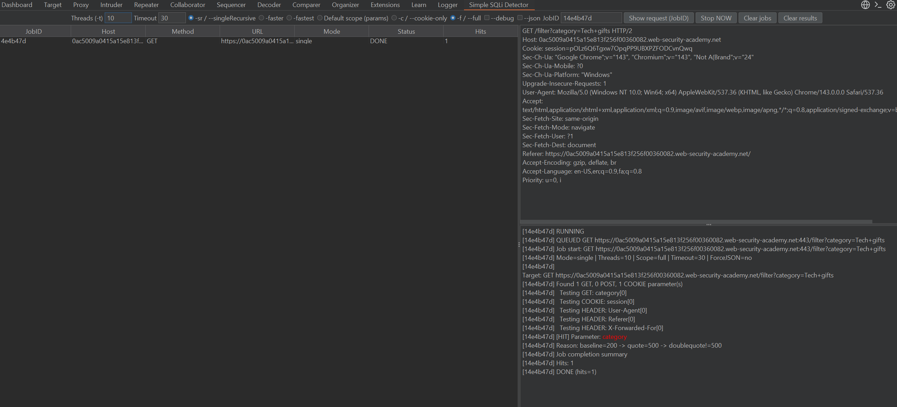
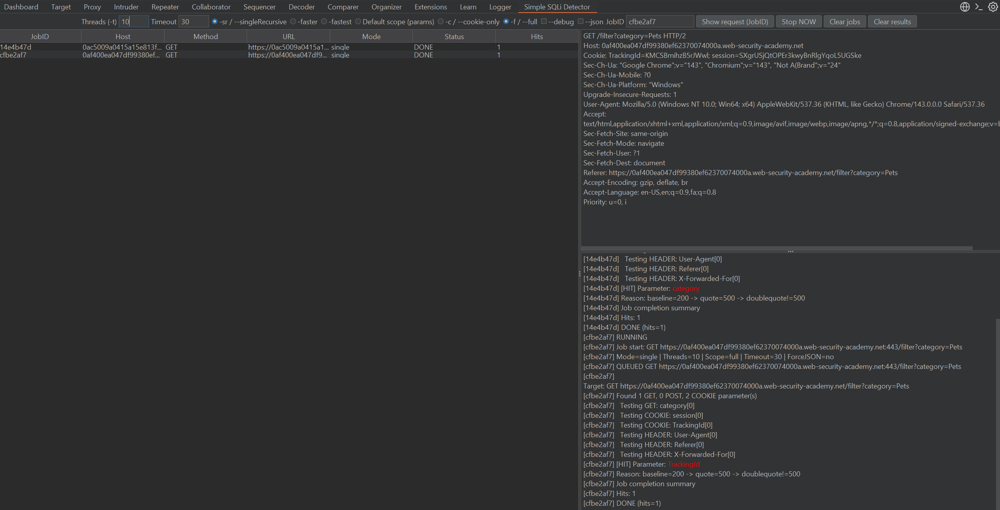

# Simple SQLi Detector (Burp Extension - Jython 2.7)

A lightweight Burp Suite extension that queues requests and runs a **heuristic SQLi signal check** while keeping the original detection logic untouched.

This extension is designed for speed-of-use in Burp:
- Right-click a request anywhere you can select it → send it to the extension
- It runs in a **single-worker job queue** (no blocking your workflow)
- It highlights hits, writes a helpful comment, and can forward the initiating request to tools like Repeater

---

## What it detects (heuristic)

This extension looks for the pattern:

1. Send **baseline** request (original request)
2. Mutate **one input at a time** by appending a single quote (`'`)  
   - if response becomes **500**
3. Mutate the same input by appending a double single-quote (`''`)  
   - if response becomes **NOT 500**

If the pattern matches, the input is reported as a probable SQLi signal.

> Important: This is **heuristic**, not proof. It’s intended to quickly surface likely candidates for manual verification.

---

## Key features

### Core workflow
- **Context menu integration**: Right-click a single request → **Send to Simple SQLi Detector**
- **Queued execution**: jobs are queued and processed one-by-one (no waiting to enqueue more)
- **Results UI**:
  - Jobs table: JobID, host, method, URL, mode, status, hit count
  - Request viewer: quickly see the initiating request by JobID
  - Log pane: parameter-by-parameter testing output
- **Hit visibility**:
  - Parameters are printed in **red** in the log pane
  - Original Burp request gets **highlighted red**
  - A comment is attached explaining the reason

### Modes (same detection logic, different selection/strategy)
- `-sr / --singleRecursive` (default): tests inputs one-by-one (slowest, most reliable)
- `-faster`: batch test with single-recursive fallback
- `-fastest`: batch test with double-quote verification + fallback

### Scope
- Default scope (params)
- `-c / --cookie-only`
- `-f / --full` (default selection in the current UI)

### `--json` behavior (important)
When **`--json`** is enabled:
- The extension will run **JSON-only mode**
- It will **only** test **JSON string leaf values**
- It will **only** run when the request is **POST**
- It supports **nested JSON** (paths like `user.profile.name`, arrays, etc.)

If the request is not POST or doesn’t contain valid JSON, it will skip with a log message.

### Send-to tools (from JobID)
You can forward the *initiating request* for a given JobID to:
- **Repeater**
- **Intruder**
- **Comparer**

Available via right-click menus on:
- The **Jobs table**
- The **Request viewer pane** (the “shown request”)

---

## Requirements

- **Burp Suite Professional or Community**
- **Jython 2.7 standalone JAR** configured in Burp
  - Typically: `jython-standalone-2.7.2.jar`

> This extension targets Jython (Python 2.7 runtime). It avoids non-ASCII characters to prevent common Jython encoding issues.

---

## Installation

1. Download **Jython standalone**:
   - `jython-standalone-2.7.2.jar`

2. In Burp:
   - `Extender` → `Options` → `Python Environment`
   - Set **Location of Jython standalone JAR** to your `jython-standalone-2.7.2.jar`

3. Load the extension:
   - `Extender` → `Extensions` → `Add`
   - Extension type: **Python**
   - Select the extension `.py` file

4. You should now see a new tab:
   - **Simple SQLi Detector**

---

## Usage

### 1) Send a request to the queue
- In Proxy / HTTP history / Target / anywhere you can select a request:
  - Right-click the request
  - Choose **Send to Simple SQLi Detector**

A new Job row appears with a **JobID** and status **QUEUED**, then **RUNNING**, then **DONE** (or **ERROR**).

### 2) Tune settings (top bar)
- **Threads (-t)**: worker threads used for per-parameter tests inside a job
- **Timeout**: per HTTP call timeout (seconds)
- **Mode**: singleRecursive / faster / fastest
- **Scope**: Default / cookie-only / full
- `--debug`: prints extra debug logs
- `--json`: JSON-only POST mode (nested supported)

### 3) View the initiating request by JobID
- Copy the **JobID**
- Paste into the **JobID** field
- Click **Show request (JobID)**
- The initiating request appears in the Request viewer pane

### 4) Send the request to Repeater (most common)
Option A (Jobs table):
- Right-click a job row
- Click **Send to Repeater**

Option B (Request viewer):
- Ensure the JobID is loaded/shown
- Right-click inside the Request viewer
- Click **Send shown request to Repeater**

---

## Output behavior

When a hit is found:
- The initiating message is:
  - highlighted **red**
  - commented with a summary line per hit
  - optionally added to the Site Map (implementation dependent)
- Log pane will show:
  - tested parameters
  - hit parameters printed in **red**
  - reason: `baseline=<x> -> quote=500 -> doublequote!=500`

---

## Troubleshooting

### Extension won’t load / errors about Python environment
- Confirm Jython is configured:
  - `Extender → Options → Python Environment`
- Use a **Jython 2.7 standalone** JAR (e.g., 2.7.2)

### Nothing happens when sending requests
- Make sure you selected **exactly one** request (context menu requires 1)
- Check the extension tab log pane for worker/job errors

### `--json` keeps skipping
- `--json` only runs for **POST** requests
- Body must be valid JSON (or Content-Type indicates JSON and body parses as JSON)

### Requests time out
- Increase **Timeout**
- Reduce **Threads**
- If the target is slow or rate-limiting, consider adding delay externally (not part of this extension)

---

## Notes / Limitations

- Heuristic detection only; always confirm manually.
- Network/WAF behavior can cause false positives/negatives (e.g., 500 caused by rate limiting or backend instability).
- Some Burp versions differ slightly in Intruder API signatures; the extension includes a fallback.

---

## Legal / Ethical

Use only on systems you own or have explicit permission to test (e.g., bug bounty scopes). You are responsible for compliance with program rules and local laws.

---

## Screenshots

### `-h` output

- 
- 

---
