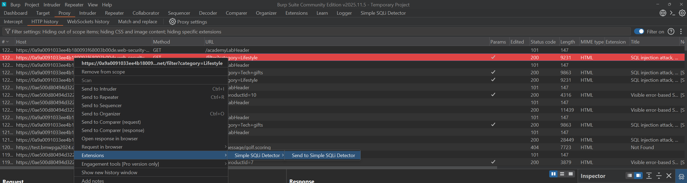

# Simple SQLi Detector (Burp Extension - Jython 2.7)

A lightweight Burp Suite extension that queues requests and runs a **heuristic SQLi signal check** while preserving the original detection logic.

Designed for fast, non-blocking use inside Burp:
- Right-click any single request → **Send to Simple SQLi Detector**
- Jobs run in a **single-worker queue** (enqueue as many as you want instantly)
- Hits are clearly highlighted with red parameter names, request highlighting, and comments

---

## What it detects (heuristic)

The extension checks for this classic error-based SQLi signal:

1. Send the **original (baseline)** request  
2. Append a **single quote (`'`)** to one parameter at a time  
   → If response becomes **500 Internal Server Error**  
3. Append **double single-quote (`''`)** to the same parameter  
   → If response is **NOT 500**

If this pattern matches, the parameter is flagged as a **probable SQLi signal**.

> **Important**: This is a **heuristic**, not definitive proof. Always verify manually.

---

## Key Features

### Core Workflow
- **Context menu**: Right-click a request → **Send to Simple SQLi Detector**
- **Job queue**: Jobs are processed sequentially (one at a time) in the background
- **Results tab** includes:
  - Jobs table (JobID, Host, Method, URL, Mode, Status, Hits)
  - Request viewer (show original request by JobID)
  - Log pane with detailed per-parameter output

### Hit Reporting
- Hit parameters printed in **red** in the log pane
- Original request highlighted **red** in Burp
- Comment added to the request with hit summary
- **Show Hits Only** checkbox to filter log noise and focus only on hits + reasons

### Modes
- **singleRecursive** (default): test parameters one-by-one (most reliable)
- **faster**: batch test all params with single quote, fallback to singleRecursive on 500
- **fastest**: batch single + double quote verification, fallback if needed

### Scope Options
- **params-only** – test GET/POST/JSON parameters only
- **cookie-only** – test cookies only
- **full** (default) – test parameters + cookies + common headers

### `--json` Mode
When enabled:
- Only runs on **POST** requests
- Only tests **string leaf values** in JSON bodies (nested paths supported, e.g. `user.address.street`)
- Skips if body is not valid JSON
- Forces singleRecursive mode and disables cookie/header testing

### Auto Mode
- When checked (default: on), automatically sends **in-scope** requests passing through Proxy to the detector
- **OPTIONS** preflight requests are automatically skipped

### Send to Tools
From any JobID (right-click on jobs table or request viewer):
- **Send to Repeater**
- **Send to Intruder**
- **Send to Comparer**

---

## Requirements
- Burp Suite (Professional or Community)
- **Jython 2.7 standalone JAR** configured in Burp (e.g., `jython-standalone-2.7.2.jar` or newer 2.7.x)

> This extension uses Jython (Python 2.7). Non-ASCII characters are avoided to prevent encoding issues.

---

## Installation
1. Download Jython standalone JAR (version 2.7.x)
2. In Burp → **Extender** → **Options** → **Python Environment**  
   → Select your `jython-standalone-*.jar`
3. **Extender** → **Extensions** → **Add**  
   → Extension type: **Python**  
   → Select the `.py` file
4. New tab appears: **Simple SQLi Detector**

---

## Usage

### 1. Send a request
- Right-click any single request (Proxy history, Target, Repeater, etc.)
- Choose **Send to Simple SQLi Detector**

Job appears in the table with a unique **JobID**.

### 2. Configure (top toolbar)
- **Threads (-t)**: parallel tests per job (default: 5)
- **Timeout**: seconds per HTTP request
- Mode radio buttons
- Scope radio buttons
- **json**: enable JSON-only mode
- **Auto Mode**: auto-scan in-scope proxy traffic
- **Show Hits Only**: hide normal logs, show only hits and reasons

### 3. View original request
- Copy JobID from table
- Paste into **JobID** field
- Click **Show request (JobID)** → appears in request pane

### 4. Forward to other tools
- Right-click job row → Send to Repeater / Intruder / Comparer  
  OR
- Load request by JobID → right-click in request pane → same options

### 5. Clear
- **Clear jobs**: remove all rows and stored requests
- **Clear results**: empty log and request panes

---

## Output When Hit Found
- Log shows `[HIT] Parameter: <param>` in **red**
- Reason line: `baseline=X -> quote=500 -> doublequote!=500`
- Original request gets:
  - Red highlight
  - Comment with hit details

---

## Troubleshooting
- **Extension fails to load**: verify Jython JAR is correctly set in Extender → Options
- **No jobs appear**: ensure exactly one request is selected when using context menu
- **`json` skips everything**: must be POST with valid JSON body
- **Timeouts**: increase Timeout value or reduce Threads
- **False positives/negatives**: expected with heuristics – always verify manually

---

## Notes / Limitations
- Heuristic only – not exhaustive blind/time-based detection
- No delay/rate-limiting controls (add externally if needed)
- Works best on applications that return 500 on unhandled SQL errors

---

## Legal / Ethical Reminder
Use only on targets you have explicit permission to test. Comply with all applicable laws and program rules.

---

## Screenshots

- 
- 
- 

